<h1 align="center">Huzaifa Asghar</h1>

Full Stack MERN Developer · Karachi, Pakistan

  <a href="https://github.com/mrHuzaifa14">GitHub</a> ·
  <a href="https://linkedin.com/in/mrHuzaifa14">LinkedIn</a> ·
  <a href="mailto:huzaifaasgharr@gmail.com">Email</a>

---

### About

Final year **BSCS** student at Hamdard University. I build scalable web apps with the **MERN stack** — from e-commerce platforms and LMS products to APIs and dashboards.

Currently at **@GutMapDx-Codebase**. Open to full-time roles and internships.

---

### Stack

`React` `Node.js` `Express` `MongoDB` `Firebase` `JavaScript` `Tailwind CSS`

---

### Stats

  
  
  

---

### Projects

| | |
| :--- | :--- |
| [Learning Management System](https://github.com/mrHuzaifa14/Learning-Management-System) | React, Firebase |
| [E-Commerce Website](https://github.com/mrHuzaifa14/Ecommerce-Website) | React, CSS |
| [Hotel Management System](https://github.com/mrHuzaifa14/HotelManagmentSystem) | React, JavaScript |
| [Admin Dashboard](https://github.com/mrHuzaifa14/DashBoard) | React, React Router |
| [Firebase Authentication](https://github.com/mrHuzaifa14/Firebase-Authentication) | React, Firebase |
| [Backend Practice](https://github.com/mrHuzaifa14/backendpractic) | Node.js |

---

open to work · building things that ship

